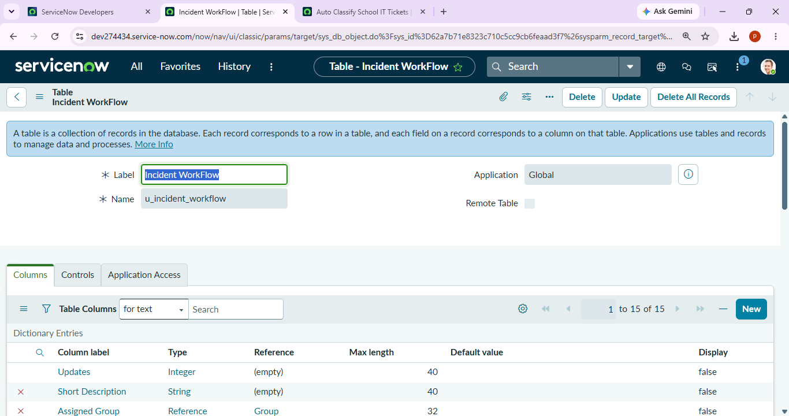

# Auto-ticket-classification-using-flow-designer-
# Auto Ticket Classification Using Flow Designer

## Project Description

This project automates the classification of tickets using ServiceNow Flow Designer.

The flow automatically checks the ticket details and updates the required classification fields. This reduces manual work and helps in faster ticket processing.

## Objective

- To automate ticket classification.
- To reduce manual effort.
- To improve ticket processing.
- To update ticket records automatically using Flow Designer.

## Technologies Used

- ServiceNow
- Flow Designer
- Incident Management
- GitHub

## Project Workflow

1. A ticket is created or updated.
2. Flow Designer is triggered.
3. The ticket information is checked.
4. The required classification is identified.
5. The record is automatically updated.
6. The updated ticket is stored in ServiceNow.

## Screenshots

### Project Created

### Table Configuration

### Update Record

## Result

The ticket classification process is automated successfully using ServiceNow Flow Designer.

## Conclusion

This project demonstrates how ServiceNow Flow Designer can be used to automate ticket classification and update records efficiently.
